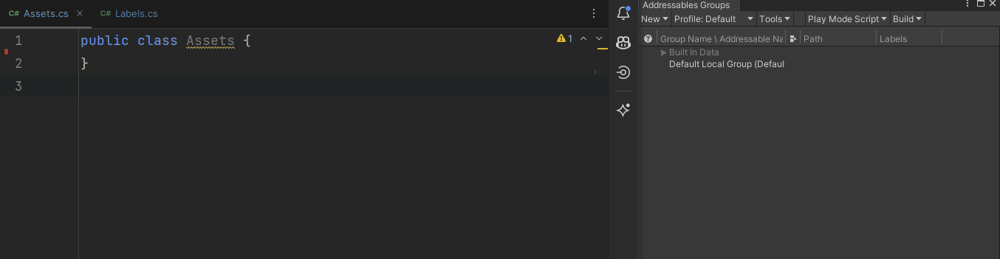

# Addressable Code Generator
Simple code generation script that automatically looks for addressable events and provides statically typed references,


## Easy install using the Unity Package Manager
```
https://github.com/AlexMeesters/AddressableCodeGenerator.git?path=Assets/Plugins/Lowscope/AddressableCodeGenerator
```

## How it works


Automatic generation can also be turned off. With the possibility of creating a hotkey instead.